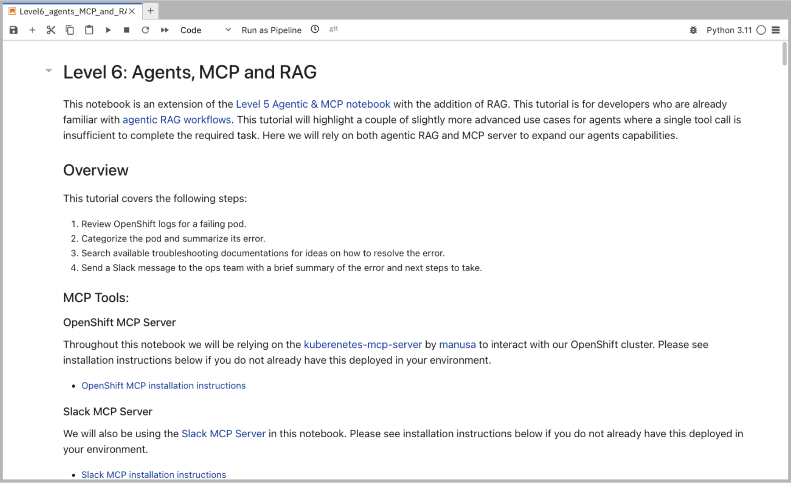
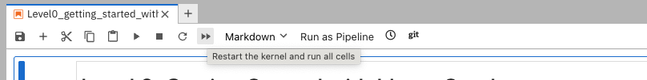

= Level 6: Agentic MCP and RAG

In this notebook, we will be building an advanced agent that interacts with multiple tools including external MCP tools and the built-in Llama Stack RAG tool.

== Learning Objectives

* *Understand how to combine advanced agentic capabilities* including prompt chaining, RAG-based knowledge retrieval, and MCP-driven OpenShift and Slack interactions, into a cohesive incident response system.
* *Learn how to design prompts that guide the agent through complex tasks* 
* *Learn how to leverage RAG to inject relevant contextual information for problem-solving* 
* *Learn how to utilize MCP tools to execute actions within our infrastructure and communicate findings effectively.*

== Slack Pre-Requisite

We will be interacting with a Slack MCP server in this notebook for which you will need to join the public Slack channel workspace using this invite link: https://join.slack.com/t/octo-emerging-tech/shared_invite/zt-35pmx4q0i-OFwWNE6nIcPEmbM7YS55yg

Once logged into the workspace make sure to join the link:https://app.slack.com/client/T08M9UTL2DC/C08MUDSNHED[#demos] channel.

== Run Notebook 6

To run this notebook, please select `Level6_agents_MCP_and_RAG.ipynb` from the file browser.

To execute the notebook cells, navigate to the top toolbar. Click the fast-forward (⏩) icon to restart the kernel and execute all cells sequentially from top to bottom.

